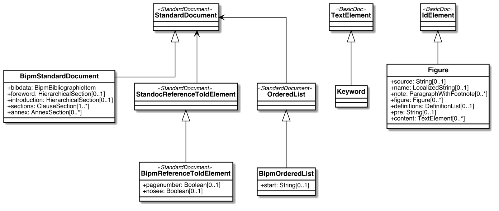

= Metanorma BIPM Models

image:https://github.com/metanorma/metanorma-model-bipm/workflows/make/badge.svg["Build Status", link="https://github.com/metanorma/metanorma-model-bipm/actions/workflows/make.yml"]

This is where we keep the Metanorma BIPM model definitions.

The BIPM Standard Document format is an instance of the
https://github.com/metanorma/metanorma-model-standoc[Metanorma StandardDocument model].
Details of the general model can be found on its page.

== BIPM Standard Document Model

== BIPM Bibliographic Item Model

image::images/BipmBibliographicItem.png[]

